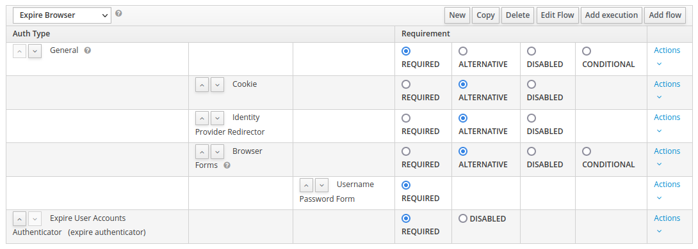
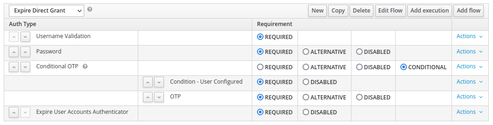
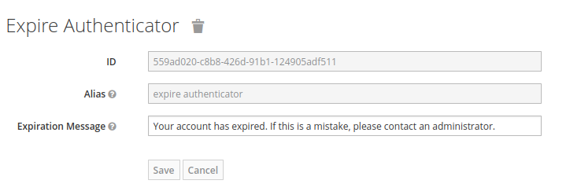

# Keycloak Expire User Accounts

This provider allows you to set an individual expiration date for user accounts.
Once that date has passed, users are no longer able to log in.

## Installation

Place the [generated jar-file](https://rechenknecht.net/giz/keycloak/expire-user-accounts/-/jobs/artifacts/master/download?job=build-jar) into the Keycloak deployments folder.
In the Keycloak Wildfly distribution it is located at `/opt/jboss/keycloak/standalone/deployments`, while in the Quarkus distribution it is located at `/opt/keycloak/providers`.

### Keycloak Flows

To actually use the authenticator, you must activate it in your Keycloak flows.

⚠ Please take care **using** all the flows you will set up in this section. Do so by using the global flow bindings of your realm and checking for every client that there is no override defined there.

For the `Browser Flow`, use something like this:

For the `Direct Grant Flow` you need something like the following:

If you use external identity providers, it is very important to check the expiration after the provider authenticated the user. Therefore, you have to overwrite the `Post Login Flow` in your identity providers with a flow that includes this authenticator.

⚠ If you use any other flows, check whether you need to add this authenticator there as well.

## Configuration

By default, the error message shown to a user is the default `noAccessMessage`:

However, you can configure the error message that is shown to the user.
To do so, visit your flow's page, click the `Actions` button on this authenticator and choose `Config`.
Then, configure the provider to your liking.

